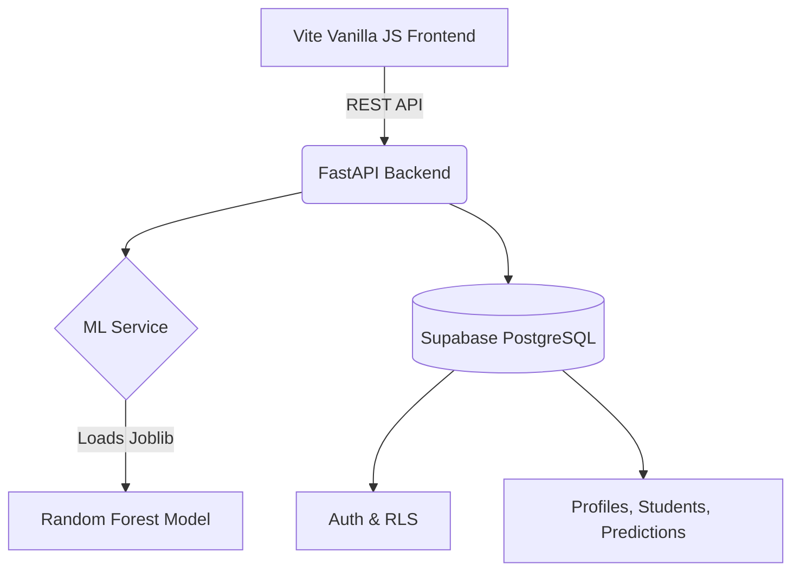

# EduPulse AI: Academic Risk & Performance Intelligence

## Project Overview
EduPulse AI is a Machine Learning-based Student Academic Risk and Performance Intelligence System. The system predicts whether a student is at risk of academic failure based on a multifaceted academic profile, manages student records, and provides interactive performance dashboards for administrators, teachers, and counselors.

## Problem Statement
Early identification of students at academic risk is crucial for timely intervention. However, educational institutions often rely on reactive measures (e.g., waiting for final grades) or disjointed data systems that fail to provide a holistic view of student performance. EduPulse AI solves this by aggregating demographic, academic, and behavioral data into a predictive model that identifies at-risk students proactively, offering explainable predictions and actionable intervention recommendations.

*Original Contribution Note: This repository contains a fully decoupled frontend, backend, and PostgreSQL database architecture built from scratch. It replaces the inherited Streamlit prototype, ensuring a scalable, production-ready SaaS deployment with proper authentication, API routing, and expanded synthetic datasets.*

## Architecture Diagram


## Dataset Description
The system uses an expanded dataset of 12,000 unique student records.
- **Original Data:** 1,000 records preserved as the baseline reference.
- **Synthetic Data:** 11,000 statistically similar records generated using a bootstrap-and-jitter method to preserve realistic correlations, marginal distributions, and feature boundaries without duplicating rows.
- **Features (14):** Age, Gender, Department, Semester, Study Hours, Attendance %, Assignment Avg, Midterm Score, Previous GPA, Internet Access, Extra Academic Support, Part-time Job, Extracurricular Hours, Absences.
- **Target:** `at_risk` (0 = Not At Risk, 1 = At Risk)

## Setup & Local Development Instructions

### 1. Prerequisites
- Python 3.9+
- Node.js 18+
- Supabase Account

### 2. Backend Setup
```bash
cd backend
python -m venv venv
source venv/bin/activate  # On Windows: venv\Scripts\activate
pip install -r requirements.txt
```

Create a `.env` file in the `backend` directory:
```env
SUPABASE_URL=your_supabase_project_url
SUPABASE_KEY=your_supabase_anon_key
```

Run the FastAPI server:
```bash
uvicorn main:app --reload --host 0.0.0.0 --port 8000
```
API Documentation is available at `http://localhost:8000/docs`.

### 3. Frontend Setup
```bash
cd frontend
npm install
npm run dev
```
Access the frontend at `http://localhost:5173`.

### 4. Database Setup
Execute the SQL schema found in `database/schema.sql` in your Supabase SQL Editor to create the necessary tables and Row Level Security (RLS) policies.

## API Documentation
- `GET /health` - API Health check & connections status.
- `POST /predict/single` - Returns risk prediction, probability, level, factors, and intervention. Requires `StudentInput` JSON.
- `POST /predict/batch` - Processes an array of `StudentInput` records.
- `GET /dashboard/summary` - Returns KPIs for the dashboard.
- `GET /metrics` - Returns ML model cross-validation and test set metrics.

## Model Results
Five models were evaluated using 5-Fold Stratified Cross Validation on 11,750 records and tested on an untouched original subset of 250 records.

**Selected Model:** Random Forest
- **Accuracy:** 0.976
- **Precision:** 0.971
- **Recall:** 0.851
- **F1-Score:** 0.918
- **ROC-AUC:** 0.998

The Random Forest model was selected for its excellent balance of Recall and F1-Score, ensuring minimal missed at-risk students while keeping false alarms very low, as well as its inherent feature importance explainability.

## Live Deployments
- **Frontend (Vercel):** [https://edupulse-ai-frontend.vercel.app](https://edupulse-ai-frontend.vercel.app) *(Pending Deployment)*
- **Backend (Railway):** [https://edupulse-ai-backend.up.railway.app](https://edupulse-ai-backend.up.railway.app) *(Pending Deployment)*

## Screenshots
*(Add screenshots of Dashboard, Prediction Form, and Dataset Explorer here after deployment)*
